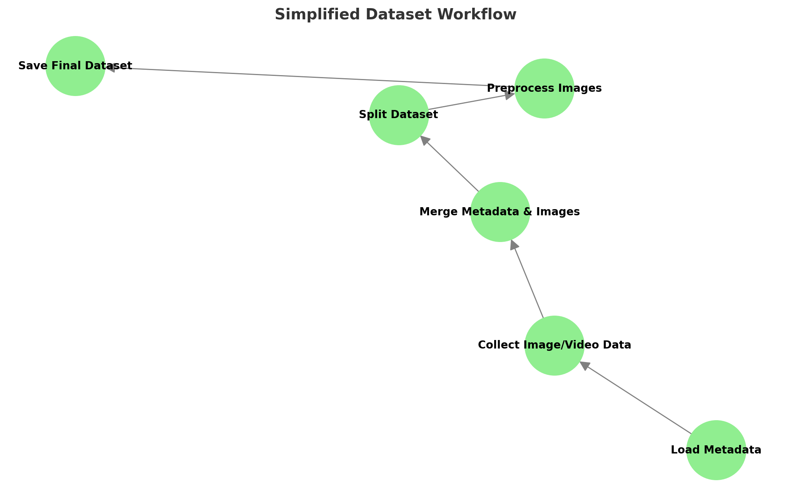
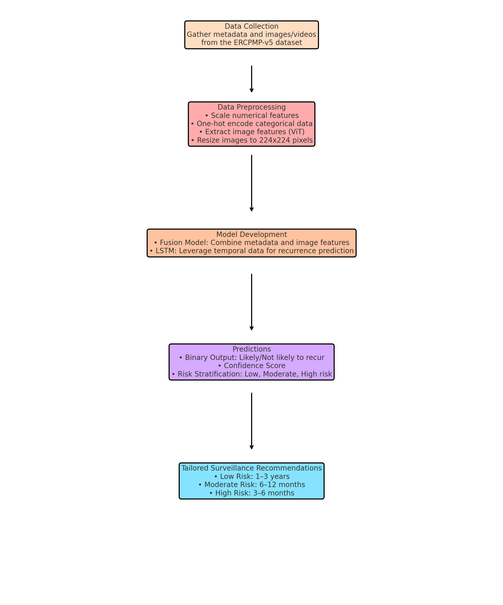
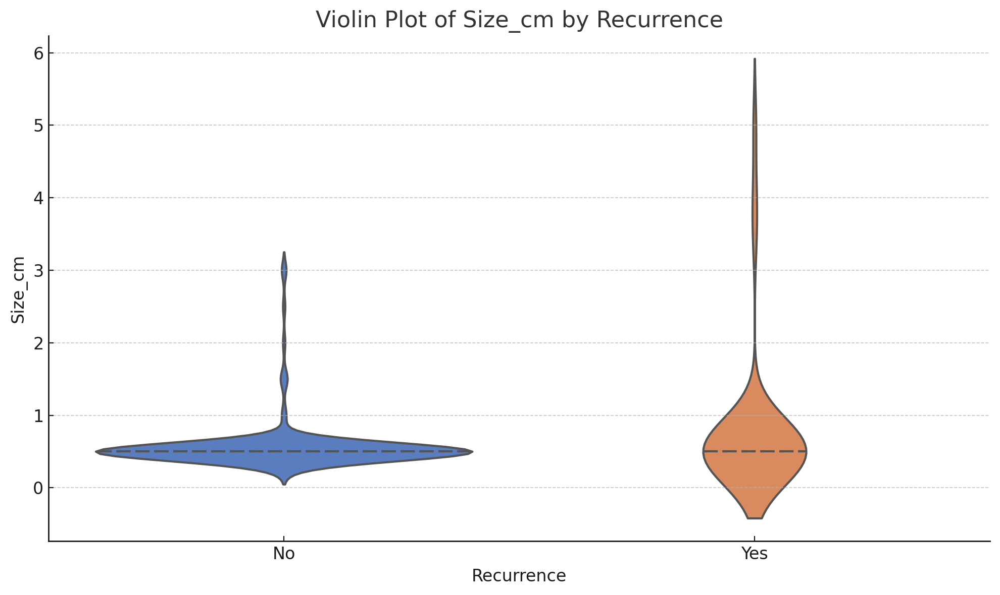

# Polyp-Recurrence-Prognostic-and-Surveillance-Model
Multimodal AI Framework for Predicting Polyp Recurrence and Tailored Surveillance Recommendations

---

## **Table of Contents**
1. [Abstract](#abstract)
2. [Project Objectives](#project-objectives)
3. [Dataset Description](#dataset-description)
4. [Dataset Preprocessing](#dataset-preprocessing)
5. [Implementation Approach](#implementation-approach)
   - [Multimodal AI Framework](#multimodal-ai-framework)
   - [Fusion Model](#fusion-model)
6. [Workflow Diagram](#workflow-diagram)
7. [Model Outputs](#model-outputs)
8. [Analysis of Metrics](#analysis-of-metrics)
9. [Key Observations](#key-observations)
10. [Conclusion](#conclusion)
11. [License](#license)
---

## **Abstract**
Colorectal cancer (CRC) remains one of the leading causes of cancer-related morbidity and mortality worldwide, with adenomatous polyps serving as a key precursor lesion. Timely detection and removal of polyps during colonoscopy significantly reduce the risk of CRC; however, recurrence of polyps is common, necessitating vigilant post-polypectomy surveillance. Advances in machine learning and data integration offer opportunities to improve post-polypectomy surveillance and reduce associated morbidity.

This project focuses on developing an **AI-Enhanced Prognostic Model** for predicting the recurrence of polyps after polypectomy using the **ERCPMP-v5 dataset**, which includes patient metadata, polyp characteristics, and imaging data. The model is designed to help clinicians with early detection of recurrence, efficient allocation of surveillance resources, and improved patient outcomes. By leveraging **multimodal data**, the system provides accurate predictions and surveillance recommendations.

---

## **Project Objectives**
The primary objective of this project is to develop a **Multimodal AI Model** for predicting the recurrence of polyps after polypectomy and recommending tailored surveillance intervals. This AI system, utilizing the **ERCPMP-v5 dataset**, aims to assist clinicians in:

- **Early Detection of Recurrence or New Polyps**: By analyzing patient metadata and imaging data, the model helps identify patients at high risk of recurrence.
- **Optimal Allocation of Surveillance Resources**: The AI system prioritizes patients based on risk, ensuring more efficient allocation of healthcare resources.
- **Improved Patient Outcomes**: Through timely interventions and follow-ups, the model aims to improve long-term health outcomes and reduce the risks associated with CRC.

The system aims to provide actionable insights for clinicians to optimize surveillance strategies and improve patient care.

---

## **Dataset Description**
The ERCPMP-v5 dataset contains detailed endoscopic images, videos, and patient data focused on the morphology and pathology of colorectal polyps. Key details:

- **Patients**: Data from 217 patients.
- **Images & Videos**: 430+ anonymized images and videos.
- **Demographic Data**: Includes patient demographics.
- **Morphological Data**: Classifications based on Paris, Pit, and JNET Classification systems.
- **Pathological Data**: Includes diagnoses like Tubular, Villous, Tubulovillous, Hyperplastic, and more.

  ### **Dataset Link**
[Access the ERCPMP-v5 dataset here](https://data.mendeley.com/datasets/7grhw5tv7n/6/files/72cc0287-84ad-4ade-ae74-8e1e8b30c0a4)

### Contributors
Prepared by experts in Gastroenterology, Hematology, Oncology, and Artificial Intelligence.

---

## **Dataset Preprocessing**
1. **Metadata Preprocessing**: Patinet_ID is the Unique identifier for each patient with morphological and pathological details.
    - Scaled numerical features (e.g., age, polyp size).
    - One-hot encoded categorical features (e.g., dysplasia grade, morphology classification).
2. **Image and Video PreProcessing**: Images and videos are processed to ensure that they are correctly associated with the corresponding Patient_ID.Frames extracted at 2 FPS, resized to 224x224 pixels, and normalized to [0, 1].
3. **Data Merging**: Using Patient_ID as a key, image paths are merged with the metadata. This links each image/frame with the corresponding demographic, morphological, and pathological details.
4. **Splitting the Dataset**:
   - Training Set (60%)
   - Validation Set (20%)
   - Test Set (20%)
5. **Final Dataset Creation**: The final dataset includes:
- Metadata: Patient and polyp-specific information (size, morphology, diagnosis, etc.).
- Image Paths: Linking images/frames to patient metadata.
- Split Information: Indicates whether an entry belongs to training, validation, or test sets.

---
## **Dataset Workflow**

---

## **Implementation Approach**
### **Multimodal AI Framework**
The Multimodal AI refers to an approach that combines and processes multiple types of data (here text metadata and image data) together to make predictions or provide insights. In this project, Multimodal AI is used to combine:
1. Metadata: Information about the patient (like age, sex) and polyp characteristics (like size, location, and dysplasia grade).
2. Image Features: Detailed information extracted from colonoscopy images or video frames.

By integrating these two types of data, the system creates a more comprehensive understanding of the patient's condition, which helps make better predictions about polyp recurrence and provides tailored surveillance recommendations.

### **Fusion Model**
Fusion Model:
A Fusion Model is a deep learning approach that combines information from multiple sources (or modalities) to make predictions. In this project, it combines:
1. Metadata Features: Information like patient demographics (e.g., age, sex) and polyp characteristics (e.g., size, location, dysplasia grade).
2. Image Features: Detailed visual information extracted from colonoscopy frames using a pre-trained model like Vision Transformer (ViT).

Why Use a Fusion Model?
Multimodal Learning: A fusion model integrates multiple or diverse data types, combining metadata for contextual information (e.g., patient history) with images that capture detailed visual characteristics of polyps. In simple terms, a Fusion Model is like combining two experts—one analyzing patient details and the other examining polyp images—to make the best possible prediction about recurrence risk and follow-up care.

---

## **Workflow Diagram**

---
## **Model Outputs**
### **Primary Outputs**
1. **Binary Prediction**: Whether a polyp is likely to recur or not likely to recur .
2. **Confidence Score**: A probability score (ranging from 0 to 1) indicating how certain the model is about the binary prediction.
- Example: A prediction of "Likely to Recur" with a confidence score of 0.85 (85%).

### **Secondary Outputs**
1. **Risk Categories**: Based on the confidence score, the model stratifies the patient into one of the following risk categories:
   - Low Risk: Probability < 30%.
   - Moderate Risk: Probability 30–70%.
   - High Risk: Probability > 70%.
2. **Tailored Surveillance Recommendations**: For each patient, the model suggests an optimal follow-up interval based on the risk category:
   - Low Risk: Follow-up in 1–3 years.
   - Moderate Risk: Follow-up in 6–12 months.
   - High Risk: Follow-up in 3–6 months.

---

## **Analysis of Metrics**
- **Test Loss**: 0.0013 (high accuracy, minimal error).
- **Test Accuracy**: 99.89% (state-of-the-art performance).

---

## **Key Observations**
### **Violin Plot Analysis**
1. **Larger Polyp Sizes and Recurrence**:
   - Polyps with Recurrence show a higher median size and greater variability, indicating size may be a risk factor for recurrence.
2. **Non-Recurrent Polyps**:
   - Not Recurrence polyps are smaller and have a tightly packed size distribution.
3. **Distinct Categories**:
   - The clear separation between No and Yes categories suggests Size_cm is a strong feature for predicting recurrence risk.
4. **Outliers**:
   - Larger-sized polyps (>5 cm) are seen in the Yes Recurrence group, indicating potential extreme cases.

---

## **Conclusion**
The AI-Enhanced Prognostic Model leverages multimodal data to provide actionable insights for post-polypectomy care. By delivering tailored surveillance recommendations, the model reduces unnecessary procedures and ensures early detection of recurrent polyps in high-risk patients. Additionally, it facilitates effective resource allocation by identifying low-risk patients, enabling more frequent monitoring for high-risk cases. Ultimately, this personalized approach enhances post-polypectomy outcomes, minimizing the risk of missed or delayed detection and improving overall patient care.

---

## **License**

The dataset used in this project is licensed under the Attribution 4.0 International (CC BY 4.0). For more details, visit the [Creative Commons License](https://creativecommons.org/licenses/by/4.0/).

---
